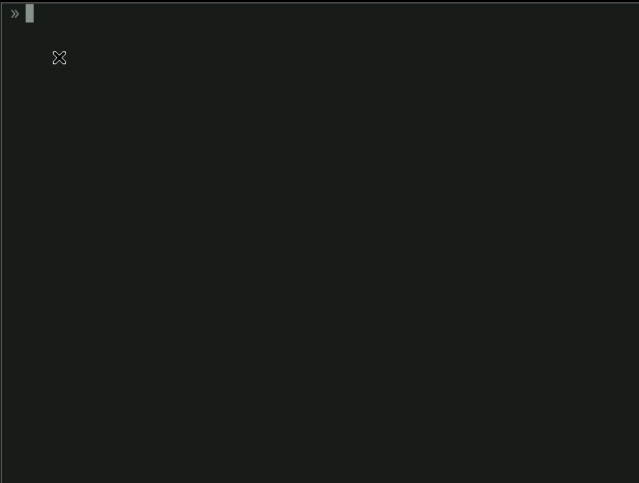

tdraw
---
Inspired by [Explaining Code using ASCII Art](https://blog.regehr.org/archives/1653).<br/>
Supports box / line drawing, text input and eraser.



#### Install
```
go get -u github.com/aca/tdraw
```
or download from https://github.com/aca/tdraw/releases

#### Usage
```
tdraw > draw.txt
```

```
// tdraw has 4 mode.
ESC: Box(+Undirected line, default)
l: Directed line
t: Text
e: Erase

CTRL-C/CTRL-D: exit

// It might not work if terminal emulator consumes right click(iterm2)
MouseR: Eraser 
```
